> [!NOTE]
> 本仓库维护「重庆理工大学开源计划」的品牌标准、设计资产与通用模板，并提供基于 Astro Starlight 搭建的简体中文版规范网站。

> [!IMPORTANT]
> 「重庆理工大学开源计划」是由学生及贡献者维护的非官方开源社区，不代表重庆理工大学或任何校内机构。

## 快速开始

要求 Node.js 24 和 pnpm 10.32.1。

```bash
pnpm install
pnpm dev
```

常用命令：

| 命令                | 用途                             |
| ------------------- | -------------------------------- |
| `pnpm dev`          | 构建资产并启动本地规范网站       |
| `pnpm build`        | 生成全部资产和静态网站           |
| `pnpm assets:build` | 从 SVG 源文件导出 PNG 与下载资源 |
| `pnpm check`        | 格式、类型、构建和内部链接检查   |
| `pnpm test`         | 对比度和资产测试                 |
| `pnpm test:e2e`     | 响应式和可访问性浏览器测试       |
| `pnpm verify`       | 执行完整验收流程                 |

## 仓库结构

```text
apps/docs/       Astro Starlight 规范网站
assets/logo/     标志源文件和导出物
assets/templates/仓库封面、分享图和状态卡模板
scripts/         资产构建脚本
tests/           单元与浏览器验收测试
```

SVG 是资产源文件；PNG 和下载目录由脚本生成。不要直接修改生成物。

## GitHub Pages 部署

推送到 `master` 后，CI 会先执行完整验收，再将网站部署至：

<https://cqut-openproject.github.io/.github/>

工作流通过 GitHub Pages 提供的站点地址和基础路径构建，因此仓库名或 Pages 配置变化时无需手动修改 Astro 配置。本地模拟当前 Pages 构建可使用：

```bash
SITE_URL=https://cqut-openproject.github.io BASE_PATH=/.github/ pnpm build
```

## 许可

| 内容                    |               许可               |
| ----------------------- | :------------------------------: |
| 代码与构建脚本          |         [MIT](./LICENSE)         |
| 规范文档、通用模板      |   [CC BY 4.0](./LICENSE-DOCS)    |
| CQUT-OSP 标志和组织名称 | [品牌使用政策](./BRAND-USAGE.md) |

第三方工具与资产声明参见 [THIRD-PARTY-NOTICES.md](./THIRD-PARTY-NOTICES.md)。
